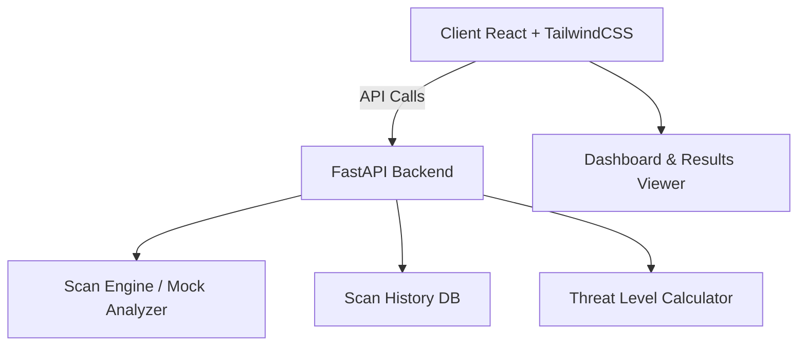
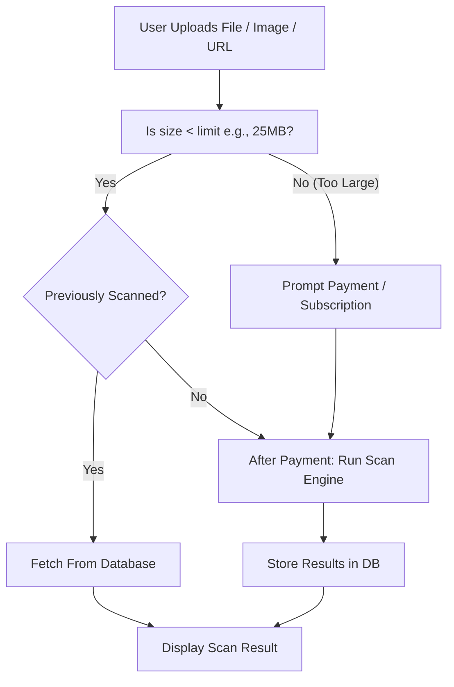

# Sentra by Wannacryptic - Hackathon 18/05/2025 SAS - UNITBV

**Sentra by Wannacryptic** is a modern, lightweight web application for scanning files and URLs to detect potential threats. It serves as a Minimum Viable Product (MVP) demonstrating core features found in full-scale malware analysis platforms.

## ✨ Key Features

- 🔍 **File Upload Scanning**  
  Scan binaries, executables, and image files for malicious indicators.

- 🌐 **URL Scanning**  
  Analyze suspicious URLs for phishing or malware behavior.

- 📊 **Interactive Dashboard**  
  View real-time statistics on scans, threats detected, and history.

- 🧠 **Threat Indicators**  
  Clear and visual display of risk levels with mock scan simulations.

- 🗂️ **Scan History**  
  Keep track of previous scan results for audit or review purposes.

- 📁 **Multi-Format Support**  
  Accepts a wide range of file formats with backend validation.

- ⚠️ **Threat Level Visualization**  
  Uses colors and icons to highlight severity levels at a glance.

- 🎨 **User-Centric UI Design**  
  Built with TailwindCSS for a sleek, professional, and responsive interface.

## 🛠️ Tech Stack

- **Frontend:** React + TypeScript + Vite + TailwindCSS  
- **Backend:** FastAPI (Python)

## 📱 Responsive Design

- Clean card-based layout  
- Professional typography with ample white space  
- Smooth loading states and scanning animations  
- Mobile, tablet, and desktop compatibility

 

## 🧩 System Architecture

## ⚙️ System Functionality
-------------------
